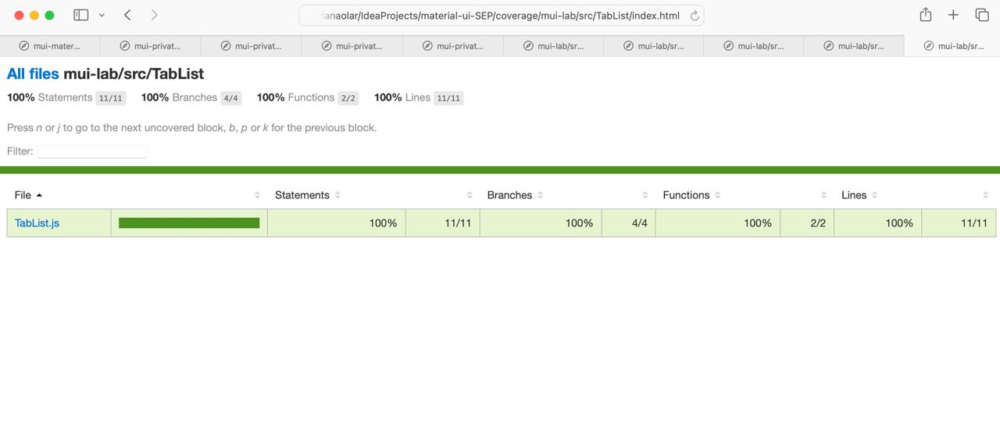
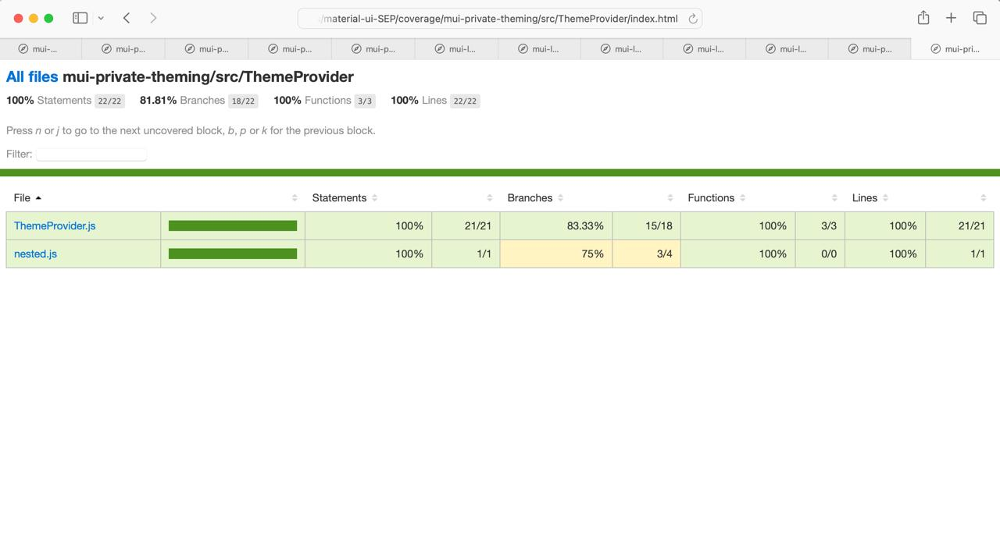
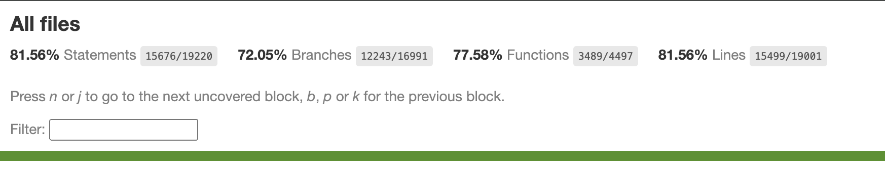

# Report for Assignment 1

## Project chosen

Name: material-ui

URL: https://github.com/mui/material-ui.git 

Number of lines of code and the tool used to count it: 556495, Lizard

Programming language: JavaScript

## Coverage measurement

### Existing tool

Name of the existing tool: Istanbul

How it was executed: 

1. Run coverage of entire project: pnpm run test:coverage

2. Open coverage file: open coverage/index.html

3. Run test coverage of single file: pnpm run test:coverage:single ‘path_to_the_file’

### Your own coverage tool
  
Raluca

<getStyleValue>

<Show a patch (diff) or a link to a commit made in your forked repository that shows the instrumented code to gather coverage measurements>

<Provide a screenshot of the coverage results output by the instrumentation>

<requirePropFactory>

<Provide the same kind of information provided for Function 1>

Briana

<Tablist>

Link to commit: (https://github.com/ambra19/material-ui-SEP/commit/82f8141451a3cd12e0d95dc6b820aa3821cb62ab)

<ThemeProvider>

Link to commit: (https://github.com/ambra19/material-ui-SEP/commit/82f8141451a3cd12e0d95dc6b820aa3821cb62ab)

Denisa

<useLoaded>

<Provide a screenshot of the coverage results output by the instrumentation>

<Transformer>

<Provide the same kind of information provided for Function 1>

Ambra

<Traverse>

Link to commit: https://github.com/ambra19/material-ui-SEP/commit/7094e7a1dd228343ef58dbca283603c9305cdada

<Provide a screenshot of the coverage results output by the instrumentation>

<getThemeValue>

Link to commit: https://github.com/ambra19/material-ui-SEP/commit/7094e7a1dd228343ef58dbca283603c9305cdada

<Provide a screenshot of the coverage results output by the instrumentation>
  
## Coverage improvement

### Individual tests

<The following is supposed to be repeated for each group member>

<Group 116>

<Test 1>

<Show a patch (diff) or a link to a commit made in your forked repository that shows the new/enhanced test>

<Provide a screenshot of the old coverage results (the same as you already showed above)>

<Provide a screenshot of the new coverage results>

<State the coverage improvement with a number and elaborate on why the coverage is improved>

<Test 2>

<Provide the same kind of information provided for Test 1>

### Overall

Old Coverage Results:

New Coverage Results:

## Statement of individual contributions

Each group member was focused on implementing their own piece of work, that is their own 2 functions.
